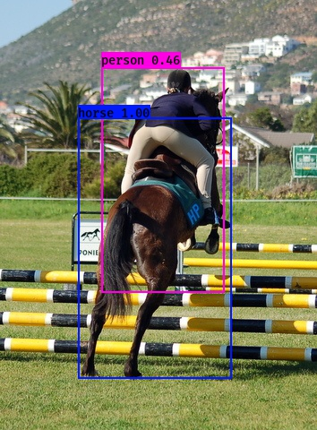

# yolov3-python

[](LICENSE)
  
## Introduction
A quick python interface for yolov3 (convert darknet-model to keras-model ) inspired by [qqwweee/keras-yolo3](https://github.com/qqwweee/keras-yolo3).

This project is just for testing and not support training.  

##Requirements
 - Python 3.7.1
 - Tensorflow-gpu 1.13.1
 - Keras 2.3.0
 - CUDA 10.0
 - cudnn-v7.4.2.24 
 
## Quick Start
1. Download YOLOv3 weights and cfg from [YOLO official website](http://pjreddie.com/darknet/yolo/), or usu your own trained weights.  
2. Convert the Darknet YOLO model to a Keras model, run convert.py  
3. Run detector.py  
```
python convert.py --config_path cfg/yolov3.cfg --weights_path weights/yolov3.weights --output_path weights/yolov3.h5
python detector.py  
--input     Input path of test images             
--output    Output path of detect results  
--model     Path to keras-model weight file  
--anchors   Path to anchor definitions  
--classes   Path to class definitions  
--gpu_num   Number of GPU to use  
--single    Single test or batch test, default batch, using 'quit' to exit the command
```
##Notice  
1. Default anchors are used. If you use your own anchors, probably some changes are needed.  
2. The speed is slower than Darknet. Replacing PIL with opencv may help a little.  

##Example  


